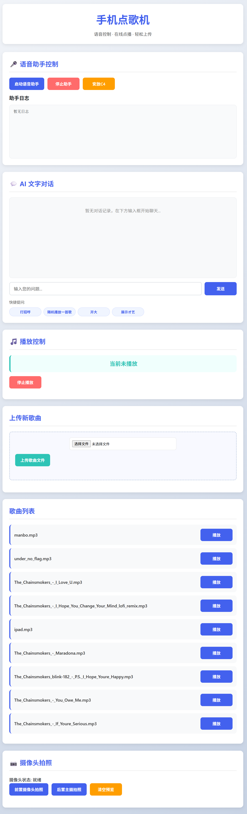

# PhonePhoenix

将旧安卓手机改造为多功能智能服务器。  
Transform your old Android phone into a multifunctional smart server.


---

## 📖 项目简介 | Introduction

PhonePhoenix 是一个运行在 Termux 环境下的项目，可以将闲置的安卓手机变身为家庭智能中心。它具备语音助手、摄像头监控、音乐播放器等功能，支持通过 Web 界面或语音控制。语音识别使用百度语音（5 万次免费额度），AI 对话使用火山引擎豆包（50 万免费 token）。

PhonePhoenix is a project running in Termux that turns idle Android phones into a home smart hub. It features a voice assistant, camera surveillance, music player, and more, controllable via a web interface or voice commands. Speech recognition is powered by Baidu AI (50,000 free requests) and AI chat by Volcano Engine Doubao (500,000 free tokens).

---

## ✨ 功能特性 | Features

- **语音助手**：通过唤醒词唤醒，支持百度语音识别和豆包 AI 对话，可播放本地音频回应。  
  **Voice Assistant**: Wake-word activation, Baidu speech recognition, Doubao AI chat, and local audio playback for responses.

- **摄像头监控**：支持前置/后置摄像头拍照，照片即时显示在 Web 界面。  
  **Camera Surveillance**: Take photos with front/rear cameras; photos appear immediately on the web interface.

- **音乐播放器**：上传 MP3 文件，随机播放，Web 界面控制。  
  **Music Player**: Upload MP3 files, random playback, and control via the web interface.

- **文字聊天**：通过 Web 界面与 AI 进行文字对话。  
  **Text Chat**: Chat with AI via text on the web interface.

- **日志监控**：实时查看语音助手运行日志。  
  **Log Monitor**: View voice assistant logs in real time.

---

## 📱 硬件与软件要求 | Requirements

### 硬件 | Hardware

- 一台安卓手机（Android 7.0+）。注意：旧版本可能不兼容 Termux:API，导致无法调用麦克风、摄像头。
- 网络连接。

### 软件 | Software

- [Termux](https://github.com/termux/termux-app#github)（从 GitHub 或 F-Droid 下载）
- Termux:API 插件（用于摄像头、麦克风等硬件访问）
- Python 3.8+

---

## 🚀 安装步骤 | Installation

### 1. 安装 Termux 和必要工具

在手机上安装 Termux 和 Termux:API，然后打开 Termux 运行以下命令更新并安装基础工具。

Install Termux and Termux:API on your phone, then open Termux and run the following commands to update and install basic tools.

```bash
# 更新包列表并升级所有包
pkg update && pkg upgrade -y

# 安装基础工具：git, python, pulseaudio (音频支持), termux-api (硬件访问), sox (音频处理)等
pkg install git python pulseaudio termux-api sox python-pip portaudio clang binutils -y

```

如果你希望在电脑上远程管理，可以在 Termux 中安装并启动 SSH 服务：

```bash
pkg install openssh
sshd                 # 启动 SSH 服务（默认端口 8022）
passwd               # 设置密码（首次使用必须设置）
```

然后在电脑上连接：

```bash
ssh -p 8022 用户名@手机IP   # 用户名为 Termux 中的用户名（通常为 u0_aXXX）
```

> **注意**：手机 IP 可通过 `ifconfig` 或 `ip a` 查看，确保手机与电脑在同一局域网。

### 2. 克隆仓库

```bash
git clone https://github.com/djh2203/PhonePhoenix.git
cd PhonePhoenix
```

### 3. 安装 Python 依赖

```bash
# 安装 requirements.txt 中的依赖
pip install -r requirements.txt
```


### 4. 配置文件设置

复制配置文件模板并填写你的 API 密钥。

Copy the configuration template and fill in your API keys.

```bash
cp config.example.json config.json
nano config.json   # 使用 vim 或 nano 编辑
```

你需要申请以下服务：

- **百度语音**：前往 [百度 AI 开放平台](https://ai.baidu.com/) 创建应用，获取 App ID、API Key、Secret Key。
- **火山引擎豆包**：注册 [火山引擎](https://www.volcengine.com/)，创建模型接入，获取 API Key 和模型 ID。

编辑 `config.json`，填入你的密钥，并根据需要修改唤醒词、音频路径等。


将你想使用的音频文件（如打招呼、回应等）放入 `~/answers` 目录（路径可在 `config.json` 中修改）。文件名需与 `audio_commands` 中的对应。

Place your audio files (e.g., greetings, responses) in `~/answers` directory (path can be changed in config.json). Filenames must match those in `audio_commands`.

例如：`dzh.mp3`、`zx.mp3` 等。

### 6. 授予 Termux 必要的权限

语音助手和摄像头功能需要系统权限。请确保在 Android 设置中为 Termux 授予以下权限：

- **麦克风权限**：允许 Termux 录音。
- **相机权限**：允许 Termux 拍照。
- **通知权限**（可选）：用于保持后台运行。

测试权限是否正常：

```bash
# 测试麦克风
termux-microphone-record -d 3       # 录制 3 秒音频，按 Ctrl+C 停止，文件保存在当前目录
# 测试摄像头（后置摄像头 ID 通常为 1）
termux-camera-photo -c 1 /sdcard/test.jpg
```

如果命令执行成功，则权限正常。

---

## 📁 目录结构 | Directory Structure

```
PhonePhoenix/
├── app.py                 # Flask 主应用 | Main Flask app
├── assistant.py           # 语音助手核心 | Voice assistant core
├── config.json            # 你的配置文件 | Your configuration file
├── requirements.txt       # Python 依赖列表 | Python dependencies
├── LICENSE                # MIT 许可证 | MIT License
├── README.md              # 本文档 | This file
├── index.html             # Web 界面 | Web interface (should be placed in the same directory as app.py)
├── c4boom.mp3             # CS2 C4爆炸音效 | CS2 C4 Explosion Sound Effect
├── manbo.mp3              # 曼波唤醒音效（可加） | Mambo Wake-Up Sound Effect (Optional)
├── zaijian.mp3            # CS2 C4爆炸音效 | Mambo Program Exit Sound Effect
└── answers/               # 音频文件存放目录（可配置） | Audio files directory (configurable)
    ├── dzh.mp3
    ├── zx.mp3
    └── ...
```

---

## 🎮 使用方法 | Usage

### 启动 Web 服务

在 Termux 中运行以下命令启动 Flask 服务器：

```bash
python app.py
```

然后在手机浏览器中访问 `http://127.0.0.1:5000` 或 `http://你的手机IP:5000`（同一局域网内）即可打开 Web 控制面板。

### 启动语音助手

在 Web 界面点击“启动语音助手”按钮，或手动运行：

```bash
python assistant.py
```

语音助手会持续运行，检测到唤醒词后开始对话。工作流程如下：

1. 持续监听麦克风，检测唤醒词。
2. 检测到唤醒词后，播放提示音（可选）并开始录音。
3. 将录音发送给百度语音识别，转为文字。
4. 文字发送给豆包 AI，获取回答。
5. 根据回答内容查找对应的本地音频文件并播放（若未找到匹配则通过 TTS 合成）。
6. 返回监听状态。

### 主要功能 | Main Functions

- **播放歌曲**：点击歌曲列表中的“播放”按钮，或说“随机播放”。  
  **Play songs**: Click the “播放” button in the song list, or say “随机播放”.

- **拍照**：点击“前置/后置摄像头拍照”按钮，照片会显示在页面中。  
  **Take photos**: Click the “前置/后置摄像头拍照” button; photos will appear on the page.

- **文字聊天**：在 Web 界面下方输入框输入消息，与 AI 对话。  
  **Text chat**: Type messages in the input box at the bottom of the web interface to chat with AI.

- **停止播放**：点击“停止播放”按钮或说“闭嘴”。  
  **Stop playback**: Click the “停止播放” button or say “闭嘴”.

- **查看日志**：Web 界面提供实时日志显示区域，可监控语音助手运行状态。

---

## ❓ 常见问题 | FAQ

**Q：语音助手没有反应？**  
A：请按以下步骤排查：

1. 确认 `assistant.py` 已在运行（可查看进程或 Web 界面状态）。
2. 检查麦克风权限是否授予 Termux，并运行 `termux-microphone-record` 测试。
3. 检查 `config.json` 中的 API 密钥是否正确，网络连接是否正常。
4. 查看日志输出（Web 界面或终端）获取错误信息。

**Q：摄像头拍照失败？**  
A：确保已安装 Termux:API 并授予相机权限。可以尝试在 Termux 中直接运行 `termux-camera-photo -c 1 /sdcard/test.jpg` 测试。如果失败，请检查 Termux:API 是否在后台保持运行（某些系统会将其杀死）。

**Q：如何让服务在手机锁屏后继续运行？**  
A：Android 系统可能限制后台进程。建议采取以下措施：

- 在 Termux 中运行 `termux-wake-lock` 防止 CPU 休眠。
- 将 Termux 添加到电池优化白名单。
- 使用 [Termux:Boot](https://github.com/termux/termux-boot) 插件实现开机自启。

**Q：如何在公网访问 Web 界面？**  
A：如果没有公网 IP，可以使用内网穿透工具，生成公网 URL 后即可访问。

**Q：SSH 连接被拒绝？**  
A：确认 SSH 服务已启动（`sshd`），防火墙未阻止 8022 端口，且使用的用户名和密码正确。Termux 默认用户名可通过 `whoami` 查看，密码通过 `passwd` 设置。

**Q：如何自定义唤醒词？**  
A：可以在 `config.json` 中修改 `wake_word` 字段为任何你喜欢的词。

**Q：我修改了代码，如何贡献？**  
A：欢迎提交 Pull Request！

---

## 📜 许可证 | License

本项目采用 MIT 许可证，详情请查看 [LICENSE](LICENSE) 文件。  
This project is licensed under the MIT License - see the [LICENSE](LICENSE) file for details.

---

## 🙏 致谢 | Acknowledgements

- [Termux](https://termux.com/) - 强大的安卓终端模拟器
- [Flask](https://flask.palletsprojects.com/) - Python Web 框架
- [百度 AI 开放平台](https://ai.baidu.com/) - 语音识别服务
- [火山引擎](https://www.volcengine.com/) - 豆包 AI 模型

---

## 📸 界面预览 | Screenshots

---

## 📬 联系方式 | Contact

如有任何问题或建议，欢迎通过 [GitHub Issues](https://github.com/djh2203/PhonePhoenix/issues) 反馈。  
If you have any questions or suggestions, feel free to open an issue on GitHub.

邮箱：hehe22032007@outlook.com
